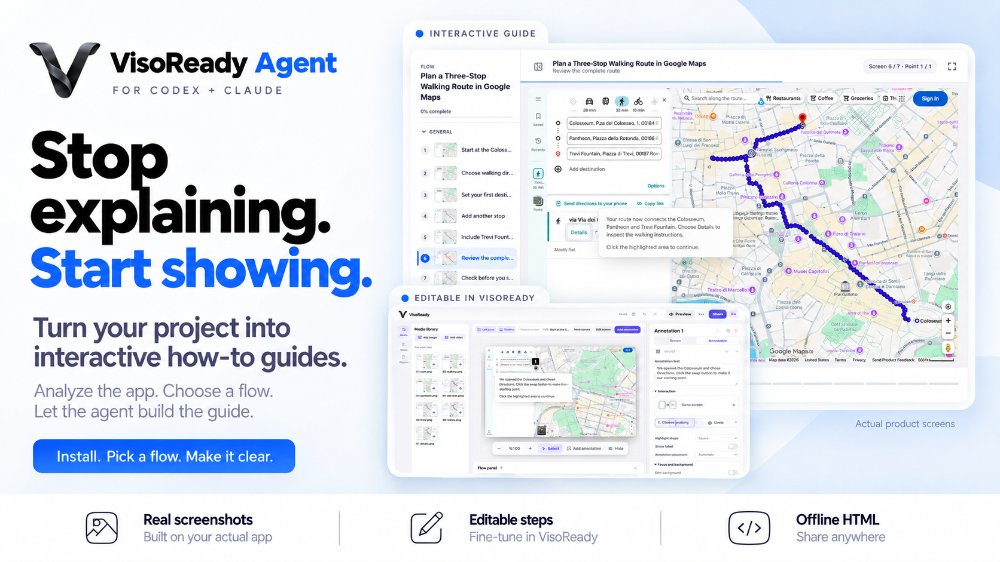

# VisoReady Agent



**Turn your application's real interface into editable, interactive how-to guides with Codex or Claude Code.**

Give the agent a local project, a Git repository or a running web app. It analyzes the product, suggests guide topics and waits for your choice. Then it captures the actual interface and produces a VisoReady project you can review, edit and share as an offline HTML file.

**Free, open-source beta.** The runtime does not call a paid model API. Your coding assistant's own account, pricing and data policies still apply.

## Try the Google Maps Demo

**Plan a Three-Stop Walking Route in Google Maps:** Colosseum, Pantheon, Trevi Fountain.

- [Demo files and instructions](demos/google-maps-walking-route/README.md)
- [Download the full package (ZIP): editor, demo and editable project](https://github.com/berkanarin/VisoReady-Agent/archive/refs/heads/main.zip)

Extract the ZIP, then open `demos/google-maps-walking-route/index.html` in your browser to play the demo. To edit it, open `VisoReady.html` at the package root and import `demos/google-maps-walking-route/project.ohig.json`. No installation is needed to play the demo or use the editor. GitHub's file viewer and raw HTML links show source code; they do not play the demo.

Seven real English screenshots, short caption headings, frame highlights and no artificial camera zoom. Open the HTML locally to play it; open the JSON with the bundled [VisoReady editor](VisoReady.html) to change it. This desktop-first tutorial is a captured walkthrough, not live navigation. On phones, the map and targets are small; use the player's Next button.

Google Maps imagery is third-party content, **not MIT-licensed**. See the [attribution notice](demos/google-maps-walking-route/ATTRIBUTION.md) and [demo verification](demos/google-maps-walking-route/QA.md).

## Install With Your Coding Assistant

Give Codex or Claude Code this prompt:

> Install VisoReady Agent from https://github.com/berkanarin/VisoReady-Agent for the coding assistant I am using. Read INSTALL.md at the repository root first. Inspect the setup commands, check prerequisites, and do not overwrite unrelated skills or change security policies. Run doctor and the bundled demo, report any failures or quality warnings, then tell me how to start a new session. Do not capture my projects yet.

The complete repository is required. Do not install only the skill subfolder or a similarly named registry package. This is a local tool for terminal-capable coding assistants, not a Claude.ai file upload or hosted service.

### Manual Installation

Requirements: **Node.js 22.13+**, **pnpm 11.25.0**, Git and internet for dependencies and Chromium.

```sh
git clone https://github.com/berkanarin/VisoReady-Agent.git
cd VisoReady-Agent
node scripts/setup.mjs --client codex
```

Use `--client claude` for Claude Code or `--client both` for both clients. Start a new assistant session after installation. Keep the repository at this location: installed skills delegate to its runtime.

**The current VisoReady HTML editor is included at the repository root.** GitHub's Code > Download ZIP includes the Agent, `VisoReady.html`, the Google Maps demo and its editable project. The editor itself opens in a browser without installing Node.js; Node.js and pnpm are needed for Agent automation.

Full instructions, updates and removal: [INSTALL.md](INSTALL.md).

## Your First Guide

Ask your assistant:

> Use VisoReady Agent to analyze my project at C:/projects/booking-desk. Suggest topics for an interactive user manual and wait for me to choose.

Then select a topic:

> Create the "Add a reservation" flow using real screenshots and English explanations. Use test data. Return an editable project and an offline preview; do not publish it.

For a running app, supply its URL. For a repository, supply its HTTPS clone URL. The UI need not already be running: the agent can inspect supported startup scripts and start a reviewed development preview. Missing backends, credentials or native application access may still require your help.

## What It Produces

| File | Purpose |
| --- | --- |
| `project.ohig.json` | Editable screens, annotations, titles and navigation |
| `review.html` | Screenshot and annotation gallery from `build` |
| `preview.html` | Offline interactive player from the VisoReady exporter |
| `manifest.json` | Capture geometry, timestamps, source references and image hashes |
| `quality.json` / `QUALITY.md` | Automated checks and items needing human review |

Open `VisoReady.html`, import the project, review it and use Share to export. Source images are preserved; guide overlays are editable. New explanations use concise titles and complementary body text. Existing projects are not silently migrated.

## Supported Today

- Source inspection and guide-topic proposals before capture.
- Real Playwright browser capture using observed DOM locators and fixed viewport geometry.
- Reviewed static, Vite and Next.js startup paths, plus running web apps.
- PNG/JPEG inputs with provenance and integrity checks.
- Auto, click, hover and next-screen annotations; frame styling and optional camera focus.
- Actual editor import/export and per-annotation desktop/mobile checks.
- Codex and Claude Code skill installers with overwrite protection.

## Limits and Privacy

This is a **0.1.0 beta**, tested on Windows. Isolated installs, both skill runners and browser tests pass. Fresh-session discovery in both real clients and macOS/Linux are not yet independently verified.

Native applications such as PowerPoint need a separately available computer-control tool. No native controller, video importer, automatic UI reconstruction or hosted AI service is included. A screenshot-based demo cannot prove that a backend saved data. Quality checks do not certify all text legibility or every interaction; review before sharing.

Use test accounts and data. Do not commit credentials, `.env`, browser sessions or private screenshots. Captures can contain sensitive information; review even masked captures. The host assistant's normal data policies still apply. Installation does not authorize production writes, publishing or sending messages.

## Development

```sh
pnpm install --frozen-lockfile
pnpm exec playwright install chromium
pnpm lint
pnpm typecheck
pnpm build
pnpm test
pnpm test:e2e
pnpm agent doctor
pnpm demo
```

The bundled local fixture is independent of Google Maps and suitable for installation checks. Reproduce the public Maps example with `pnpm exec tsx examples/google-maps-walking-route.ts output/maps-fresh`; use a new output directory and review current selectors and captures.

See [the workflow contract](skill/visoready-agent/references/workflow.md), [release checklist](RELEASE-CHECKLIST.md) and [third-party notices](THIRD-PARTY-NOTICES.md). The release builder uses an allowlist to exclude private outputs and local runtime files.

## License

Original project code is [MIT-licensed](LICENSE). Dependencies, Google Maps screenshots and other third-party assets retain their own rights and terms. VisoReady Agent is not affiliated with or endorsed by Google, OpenAI or Anthropic.
